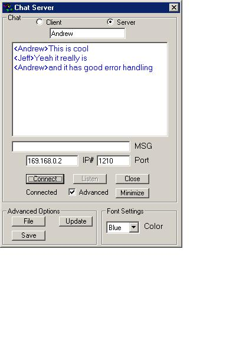



## Chat w/ sound, tray icon, color, auto update

### Description

This is a complete rebuild of my previous program. Now it uses just 1 program no chat and server. Saves all previous settings (I need help using .ini file). Has auto update, file transfer, saves the chat session, and PRINTS the chat session. Uses user names font color and i'm working on font size. Plz vote if you like and leave comments or suggestions for me.
 
### More Info
 

             |
---                |---
**Submitted On**   |2001-03-01 17:40:02
**By**             |[Andrew Parisio](https://github.com/Planet-Source-Code/PSCIndex/blob/master/ByAuthor/andrew-parisio.md)
**Level**          |Intermediate
**User Rating**    |5.0 (15 globes from 3 users)
**Compatibility**  |VB 5\.0, VB 6\.0
**Category**       |[Complete Applications](https://github.com/Planet-Source-Code/PSCIndex/blob/master/ByCategory/complete-applications__1-27.md)
**World**          |[Visual Basic](https://github.com/Planet-Source-Code/PSCIndex/blob/master/ByWorld/visual-basic.md)
**Archive File**   |[CODE\_UPLOAD15738322001\.zip](https://github.com/Planet-Source-Code/andrew-parisio-chat-w-sound-tray-icon-color-auto-update__1-21253/archive/master.zip)

